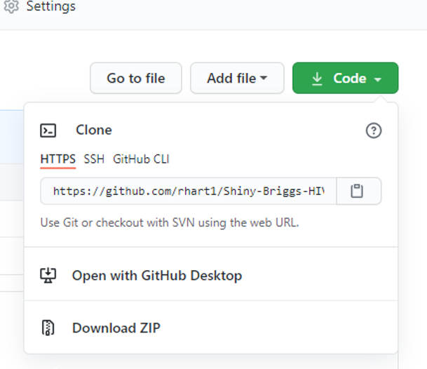
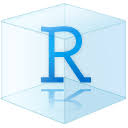

# Shiny Briggs HIV model - R in HTA showcase 2021

This is the code that accompanies the talk 'Rise and Shiny, a new dawn for HTA' in the R in HTA showcase 2021

To run the code, you will need to have both R (>= 4.0.5) and R Studio on your machine. If this is your first time using R, this online book ["An introduction to R"](https://alexd106.github.io/intro2R/index.html) is a great place to start with learning R and is not specific to health economics. Please view the [setup](https://alexd106.github.io/intro2R/setup.html) page to go through installing R and R Studio on your machines. Please install the latest version. Also, please look at the 'Introducing RStudio' video to familiarize yourself with the RStudio layout. 

## 1. Introduction to R coding

We recommend that users are familiar with the syntax and basic methods of R coding, such as how to assign variables and knowing the basic data types. Therefore, all users who are using R for the first time should undertake a practical introduction to R via DataCamp's [\textcolor{colourblue}{'Intro to basics'}](https://www.datacamp.com/courses/free-introduction-to-r) module for hands-on exercises prior to using these materials.

## 2. Accessing the materials

### 2.1. Downloading materials
If users have a GitHub account and are happy with cloning or forking a project to their own accounts, then feel free to do so. For those without a GitHub account, all project materials can be downloaded via a ZIP folder as indicated in the image below. GitHub is recommended but optional; it is useful for code version control and managing projects in any coding language. 

### 2.2. Opening materials
Once users have the materials folder via ZIP or GitHub, the project needs to be opened in RStudio as a **project**. For those who are unfamiliar with project files, they are self-contained work areas that can be managed by version control software (Git). When a user opens a project, the working directory (file location) is set automatically to the location of the project, meaning that scripts that reference other scripts (this is common in shiny apps or markdown documents, and will be covered in the 'Advanced functionality of R' part of the course).

To open the materials as a project, within RStudio, please go to 'File' -> 'Open project in New Session', then find the location where you have the materials file saved. You need to click on the '.Rproj' file. 

### 2.3. Downloading required packages
The `Packageloader()` function in the `functions.R` script loads in the required packages, and also installs any package that it cannot find on your machine. Each package is described within the scripts.

## 3. Running the scripts

To run the model script without shiny, open up `Model_Script.R` and run each line by selecting Ctrl + Enter.

To run the app, go into the 'Shiny app' folder and open `app.R`. If there is a button in the top right and side of the main panel to 'Run App', then please select this. If not, run each line in `app.R` by selecting Ctrl + Enter. This will start up the app in your default browser.

